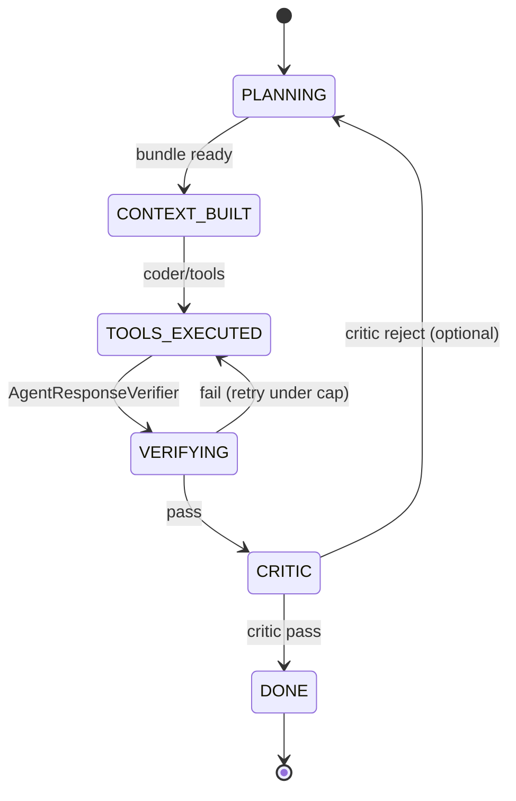

# M29: Harness Engineering Improvements — ✅ Complete

**Completed:** 2026-05-31 · Branch: `feat/m29-harness-engineering`

Implements the harness patterns from [docs/medexpert-harness-engineering-improvements-proposition.md](../../docs/medexpert-harness-engineering-improvements-proposition.md): verify loops, context bundling, Planner/Critic roles, eval CI gate, tool scoping, and a doctor-matching workflow state-machine pilot.

**Prerequisite:** M28 complete or in parallel for trust items (Step 8 depends on agent card schema). Core harness steps (1–7, 10–12) depend only on current `main` (tool split, `llm/evaluation/`, `ChatAgentProfile`).

**Related:** [docs/improvements-plan-agentic-patterns.md](../../docs/improvements-plan-agentic-patterns.md) (eval design origin), [src/main/java/.../llm/AGENTS.md](../../src/main/java/com/berdachuk/medexpertmatch/llm/AGENTS.md).

## Scope

| # | Deliverable | Branch | Status | Effort |
|---|-------------|--------|--------|--------|
| 1 | `AgentResponseVerifier` — structured post-tool validation | `feat/m29-harness-engineering` | ✅ | 8h |
| 2 | `CaseContextBundleService` + tool for workflows/chat | `feat/m29-harness-engineering` | ✅ | 12h |
| 3 | `MedicalAgentCriticService` — policy pass (disclaimer, PHI, grounding) | `feat/m29-harness-engineering` | ✅ | 8h |
| 4 | Planner artefact model + persistence on chat/workflow runs | `feat/m29-harness-engineering` | ✅ | 10h |
| 5 | `ChatAgentToolScope` — enforce tools per `ChatAgentProfile` | `feat/m29-harness-engineering` | ✅ | 6h |
| 6 | Eval CI gate + baseline report (`medical-eval-v1`) | `feat/m29-harness-engineering` | ✅ | 6h |
| 7 | Workflow iteration limits + `HarnessFailureReason` codes | `feat/m29-harness-engineering` | ✅ | 6h |
| 8 | Agent card `allowedTools` + server enforcement (A2A/chat) | `feat/m29-harness-engineering` | ✅ | 6h |
| 9 | Doctor-match workflow state machine (pilot) | `feat/m29-harness-engineering` | ✅ | 16h |
| 10 | Harness telemetry metrics (Micrometer, no PHI) | `feat/m29-harness-engineering` | ✅ | 4h |
| 11 | *(Optional)* Human checkpoint API for workflows | — | ⬜ Deferred | 12h |
| 12 | Dev harness docs (Ralph Loop in `testing` skill + backlog template) | `feat/m29-harness-engineering` | ✅ | 3h |

**Total effort: ~85h (~11d); Steps 11 optional (+12h).**

Ship order: **1 → 2 → 3 → 5 → 4 → 6 → 7 → 10 → 8 → 9 → 12 → 11**.

---

## Architecture (target)



Pilot workflow: `MedicalAgentDoctorMatchingWorkflowServiceImpl` (Step 9). Chat path: `ChatAssistantServiceImpl` (Steps 2–5).

---

## Step 1: AgentResponseVerifier

**Goal:** Ralph **Observe** step for API workflows — validate tool/JSON outputs before final LLM narrative.

**Prerequisites:** None.

### TDD

1. `AgentResponseVerifierTest` — pass/fail for min match count, required metadata keys, empty list.
2. `MedicalAgentDoctorMatchingWorkflowServiceImplTest` (or IT) — verifier failure surfaces `HarnessFailureReason.TOOL_OUTPUT_INVALID`.

### Files

| Action | File | Purpose |
|--------|------|---------|
| **NEW** | `llm/harness/AgentResponseVerifier.java` | Interface: `VerificationResult verify(VerificationRequest)` |
| **NEW** | `llm/harness/VerificationRequest.java` | record(workflowType, caseId, toolPayload, rules) |
| **NEW** | `llm/harness/VerificationResult.java` | record(passed, violations, reasonCode) |
| **NEW** | `llm/harness/DoctorMatchVerificationRules.java` | minMatches, required fields on `DoctorMatch` |
| **NEW** | `llm/harness/impl/AgentResponseVerifierImpl.java` | Default impl |
| **MOD** | `MedicalAgentDoctorMatchingWorkflowServiceImpl.java` | Call verifier after `match_doctors_to_case`, before interpret LLM |
| **NEW** | `src/test/.../harness/AgentResponseVerifierTest.java` | Unit tests |

### Acceptance

- `matchDoctors` returns error metadata (not raw LLM prose) when match list empty and rules require `min_matches >= 1`.
- No PHI in verifier logs — only caseId + reason codes.

---

## Step 2: CaseContextBundleService

**Goal:** Dedicated **Context Builder** — retrieve, rank, compress case context for Planner/Coder.

**Prerequisites:** Step 1 optional (can parallel).

### TDD

1. `CaseContextBundleServiceTest` — mock retrieval/graph; assert bundle sections and token budget trim.
2. `ChatCasePromptSupportTest` — extend to use bundle when caseId present.

### Files

| Action | File | Purpose |
|--------|------|---------|
| **NEW** | `llm/harness/CaseContextBundle.java` | record(caseId, intent, coreSections, maybeSections, summary) |
| **NEW** | `llm/harness/CaseContextIntent.java` | enum: MATCH, ANALYZE, ROUTE, EVIDENCE, CHAT_AUTO |
| **NEW** | `llm/harness/CaseContextBundleService.java` | Interface |
| **NEW** | `llm/harness/impl/CaseContextBundleServiceImpl.java` | Uses `MedicalCaseRepository`, retrieval services, graph row support |
| **NEW** | `llm/tools/ContextBuilderAgentTools.java` | `@Tool buildCaseContextBundle(caseId, intent)` |
| **MOD** | `AgentToolCallingConfiguration.java` | Register context builder tools |
| **MOD** | `ChatCasePromptSupport.java` | Inject bundle summary into chat system adjunct |
| **MOD** | `MedicalAgentDoctorMatchingWorkflowServiceImpl.java` | Build bundle before LLM analyze step |
| **NEW** | `prompts/case-context-bundle-summary.st` | TL;DR template for compressed sections |

### Acceptance

- Doctor match workflow logs bundle section count (not content) in `LogStreamService`.
- Chat with valid `caseId` includes bundle summary in prompt adjunct.

---

## Step 3: MedicalAgentCriticService

**Goal:** **Critic** pass after verify — disclaimer present, `LlmResponseSanitizer` clean, evidence/tool citation heuristic.

**Prerequisites:** Step 1.

### TDD

1. `MedicalAgentCriticServiceTest` — reject missing disclaimer; reject sanitizer violations; pass grounded response with tool metadata.

### Files

| Action | File | Purpose |
|--------|------|---------|
| **NEW** | `llm/harness/MedicalAgentCriticService.java` | Interface |
| **NEW** | `llm/harness/impl/MedicalAgentCriticServiceImpl.java` | Rule-based + optional light LLM via `MedicalAgentLlmSupportService` |
| **NEW** | `prompts/medical-agent-critic.st` | External critic checklist (llm-prompts skill) |
| **MOD** | `MedicalAgentDoctorMatchingWorkflowServiceImpl.java` | Critic gate before `AgentResponse` return |
| **MOD** | `ChatAssistantServiceImpl.java` | Critic on persisted assistant messages (config flag) |

### Configuration

```yaml
medexpertmatch:
  llm:
    harness:
      critic-enabled: true
      critic-chat-enabled: true
```

### Acceptance

- Workflow response without medical disclaimer is blocked or replaced with safe fallback (no PHI in fallback text).
- Critic failures increment metric (Step 10).

---

## Step 4: Planner artefact

**Goal:** Persist plan + acceptance criteria per session/run for debug and export bundles.

**Prerequisites:** Step 2 (context for plan input).

### TDD

1. `AgentPlanArtefactRepositoryTest` or IT — insert/load by sessionId.
2. Chat export bundle IT includes `plan` section when present.

### Files

| Action | File | Purpose |
|--------|------|---------|
| **NEW** | `llm/harness/AgentPlanArtefact.java` | record(sessionId, workflowType, steps, acceptanceCriteria, createdAt) |
| **NEW** | `llm/harness/AgentPlannerService.java` | Interface: build plan from bundle + user message |
| **NEW** | `llm/harness/impl/AgentPlannerServiceImpl.java` | LLM call using `prompts/medical-agent-planner.st` |
| **NEW** | `llm/harness/AgentPlanArtefactStore.java` | JDBC or chat metadata JSON (prefer existing chat tables) |
| **MOD** | `api/schemas/chat-export-bundle.schema.json` | Optional `plan` object |
| **MOD** | `ChatAssistantServiceImpl.java` | Store plan for complex intents (profile != AUTO or explicit flag) |

### Acceptance

- Export bundle contains non-empty `plan.steps` for doctor-match chat thread in integration test.
- Plan stored without raw patient narrative — references caseId only.

---

## Step 5: ChatAgentToolScope

**Goal:** **Guarded Patch** at tool layer — each `ChatAgentProfile` may only invoke allowed tool names.

**Prerequisites:** None (benefits from Step 8 for A2A parity).

### TDD

1. `ChatAgentToolScopeTest` — SPECIALIST_MATCHER cannot call graph admin tools.
2. `ChatAssistantServiceImplTest` — out-of-scope tool call rejected before model round-trip.

### Files

| Action | File | Purpose |
|--------|------|---------|
| **NEW** | `llm/harness/ChatAgentToolScope.java` | Maps `ChatAgentProfile` → `Set<String>` allowed tool names |
| **NEW** | `llm/harness/ToolScopeEnforcingResolver.java` | Decorator on `ToolCallbackResolver` |
| **MOD** | `AgentToolCallingConfiguration.java` | Wrap resolver with scope enforcer when chat profile in context |
| **NEW** | `llm/chat/ChatToolContextHolder.java` | ThreadLocal current profile (mirror `OrchestrationContextHolder`) |

### Acceptance

- Attempt to invoke `match_doctors_to_case` from `EVIDENCE_SCOUT` profile returns structured tool error to model.
- AUTO profile uses union of tools from classified profile or full orchestrator set per existing M14 rules.

---

## Step 6: Eval CI gate

**Goal:** Ralph **Run** for prompts/tools — regression gate on `medical-eval-v1`.

**Prerequisites:** Existing `llm/evaluation/` (`EvaluationService`, `EvalScorer`, `EvaluationController`).

### TDD

1. `EvalScorerTest` — extend for doctor-match required fields.
2. `EvaluationServiceIT` — smoke run against testcontainers dataset seed.

### Files

| Action | File | Purpose |
|--------|------|---------|
| **NEW/MOD** | `src/main/resources/evaluation/medical-eval-v1.jsonl` | Canonical eval dataset (seeded by `EvaluationDatasetSeeder`) |
| **MOD** | `EvalScorer.java` | Align rules with `DoctorMatchVerificationRules` |
| **NEW** | `.github/workflows/eval-harness.yml` *(if CI exists)* or `scripts/run-eval-harness.sh` | Run eval; fail if pass rate &lt; baseline file |
| **NEW** | `src/main/resources/evaluation/baseline-pass-rate.txt` | e.g. `0.80` |
| **MOD** | `docs/improvements-plan-agentic-patterns.md` | Mark eval “CI wired” |

### Acceptance

- `mvn test -Dtest=EvaluationServiceIT` green.
- Script exits non-zero when pass rate drops more than 5% below baseline (proposition §8).

---

## Step 7: Iteration limits + HarnessFailureReason

**Goal:** Cap tool/LLM retries; classify failures for harness backlog.

**Prerequisites:** Steps 1, 3.

### TDD

1. Unit test — exceeding `maxHarnessIterations` returns `HarnessFailureReason.ITERATION_LIMIT`.
2. Enum mapping test for verifier/critic/sanitizer failures.

### Files

| Action | File | Purpose |
|--------|------|---------|
| **NEW** | `llm/harness/HarnessFailureReason.java` | enum: TOOL_OUTPUT_INVALID, CRITIC_REJECTED, POLICY_VIOLATION, ITERATION_LIMIT, TOOL_SCOPE_VIOLATION, … |
| **NEW** | `llm/harness/HarnessIterationPolicy.java` | record(maxIterations, retryOnVerifyFail) |
| **MOD** | `MatchJobStatus` / workflow metadata | Optional reason code field (string enum name) |
| **MOD** | `MedicalAgentDoctorMatchingWorkflowServiceImpl.java` | Retry loop with policy |

### Acceptance

- Metadata on failed `AgentResponse` includes `harnessFailureReason` (no PHI).
- Job status enums document reason codes in OpenAPI if exposed.

---

## Step 8: Agent card allowedTools

**Goal:** Declare and enforce tool allow-lists for A2A agents (extends M28 agent card).

**Prerequisites:** M28 Step 1 (agent card JSON Schema) recommended.

### TDD

1. Contract IT — agent card lists `allowedTools` per agent id.
2. A2A invoke with disallowed tool name → 403/structured error.

### Files

| Action | File | Purpose |
|--------|------|---------|
| **MOD** | `api/schemas/agent-card.schema.json` | `allowedTools: string[]` |
| **MOD** | `src/main/resources/.well-known/agent.json` (or generator) | Per-agent tool lists aligned with `ChatAgentToolScope` |
| **MOD** | A2A controller / chat tool resolution | Reject out-of-card tools |

### Acceptance

- `AgentCardContractIT` validates schema including `allowedTools`.
- Specialist matcher card tools ⊆ `DoctorMatchingAgentTools` + shared read tools.

---

## Step 9: Doctor-match state machine (pilot)

**Goal:** Replace implicit script in doctor matching with explicit states/events (orchestration layer pilot).

**Prerequisites:** Steps 1–4, 7.

### TDD

1. `DoctorMatchWorkflowStateMachineTest` — transitions PLANNING → … → DONE.
2. `MedicalAgentDoctorMatchingWorkflowIT` — end-to-end with test case.

### Files

| Action | File | Purpose |
|--------|------|---------|
| **NEW** | `llm/harness/DoctorMatchWorkflowState.java` | enum states |
| **NEW** | `llm/harness/DoctorMatchWorkflowEvent.java` | enum events |
| **NEW** | `llm/harness/DoctorMatchWorkflowEngine.java` | State machine driving steps |
| **REFACTOR** | `MedicalAgentDoctorMatchingWorkflowServiceImpl.java` | Delegate to engine; thin facade |
| **NEW** | `prompts/doctor-match-workflow-system.st` | Optional orchestration hints |

### States (minimum)

`TASK_CREATED` → `PLANNING` → `CONTEXT_BUILT` → `TOOLS_EXECUTED` → `VERIFYING` → `CRITIC` → `DONE` | `FAILED`.

### Acceptance

- `LogStreamService` emits state transition events (sessionId only).
- Existing REST `matchDoctors` contract unchanged (response shape stable).

---

## Step 10: Harness metrics

**Goal:** Ops visibility into harness failures (taxonomy from Step 7).

**Prerequisites:** Step 7.

### Files

| Action | File | Purpose |
|--------|------|---------|
| **NEW** | `llm/harness/HarnessMetrics.java` | Counters: `harness.verify.failure`, `harness.critic.failure`, by reason tag |
| **MOD** | Actuator/Prometheus config | Expose counters (no case text labels) |

### Acceptance

- Grafana dashboard doc snippet in plan archive or M21 admin docs cross-link.
- Metric tags limited to `reason`, `workflowType`, `agentProfile`.

---

## Step 11: Human checkpoint API (optional)

**Goal:** Pause workflow after Planner or failed verify; resume with approval token.

**Deferred** until Steps 1–9 stable. Requires product decision on clinician auth.

### Sketch

- `POST /api/v1/workflows/{runId}/checkpoint` — approve/reject plan.
- State `NEEDS_HUMAN` in doctor-match engine.

---

## Step 12: Development harness docs

**Goal:** Ralph Loop for engineers using Cursor; harness backlog template.

### Files

| Action | File | Purpose |
|--------|------|---------|
| **MOD** | `.agents/skills/testing/SKILL.md` | Section: Ralph Loop (patch → `mvn test` → structured errors) |
| **NEW** | `.agents/templates/harness-backlog-item.md` | Symptom → harness action → verification |
| **MOD** | `docs/medexpert-harness-engineering-improvements-proposition.md` | Link to this plan |

### Acceptance

- Template referenced from root `AGENTS.md` or llm `AGENTS.md` “Related Skills”.

---

## Testing strategy (mandatory TDD)

Per root `AGENTS.md`:

1. Write `*Test.java` / `*IT.java` **before** implementation for each step.
2. Review test encodes acceptance criteria (checklist in each step).
3. Run `mvn test` for unit scope; `mvn verify` before merge per step branch.
4. Eval step: add IT; do not skip Flyway/testcontainers patterns from `testing` skill.

**Key IT classes to add/extend:**

- `AgentResponseVerifierTest`
- `CaseContextBundleServiceTest`
- `MedicalAgentCriticServiceTest`
- `ChatAgentToolScopeTest`
- `EvaluationServiceIT`
- `DoctorMatchWorkflowStateMachineTest`
- `MedicalAgentDoctorMatchingWorkflowIT`

---

## Success metrics (M29 closeout)

| Metric | Baseline | Target at M29 archive |
|--------|----------|------------------------|
| Eval pass rate (`medical-eval-v1`) | Record in Step 6 | ≥ baseline; no &gt;5% drop on `main` |
| Tool scope violations (chat) | N/A | Measured; trending down after Step 5 |
| `harness.critic.failure` rate | N/A | Visible in metrics; investigated via reason codes |
| Doctor match workflow mean steps | Current ~3 LLM/tool phases | ≤ same with explicit states |
| PHI in stored chat after critic | 0 tolerance | 0 violations in IT |

---

## Risks and constraints

| Risk | Mitigation |
|------|------------|
| Extra LLM calls (Planner/Critic) increase latency/cost | Feature flags; critic rule-only mode first |
| PHI in plan artefacts | Plans reference caseId + structured fields only |
| pom.xml dependency changes | **Forbidden** without approval — use existing Spring AI stack |
| State machine breaks A2A clients | Contract tests on `AgentResponse` JSON unchanged |

---

## References

- Proposition: [docs/medexpert-harness-engineering-improvements-proposition.md](../../docs/medexpert-harness-engineering-improvements-proposition.md)
- Agentic gaps: [docs/improvements-plan-agentic-patterns.md](../../docs/improvements-plan-agentic-patterns.md)
- Prior chat harness: `.agents/plans/archive/M14-ai-chat-agent-routing.md`, `M08-agentic-patterns-improvements.md`
- Code anchors: `ChatAgentProfile.java`, `AgentToolCallingConfiguration.java`, `EvaluationService.java`, `MedicalAgentDoctorMatchingWorkflowServiceImpl.java`

**Next milestone:** [M30-harness-orchestration-expansion.md](../M30-harness-orchestration-expansion.md) — intake/routing state machines, JDBC plan store, eval IT.
