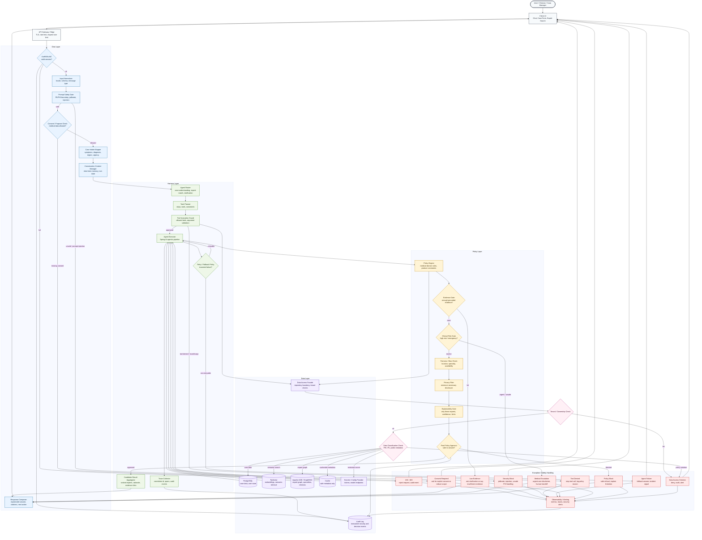

# Data Flow Architecture

This diagram shows the primary data flows between the Chat Layer, Harness Layer, Policy Layer, and Data Layer in `med-expert-match-ce`, including safety checks and exception paths.

## Review checklist

- Chat Layer validates identity, consent, prompt safety, and case intake boundaries before invoking agents.
- Harness Layer routes, plans, validates tools, executes agents, retries transient failures, and collects traces.
- Policy Layer blocks unsafe recommendations through evidence, clinical risk, fairness, privacy, and explainability gates.
- Data Layer enforces tenant checks, PHI/PII classification, GraphRAG retrieval, semantic search, and immutable audit logging.
