# Expert Matching Sequence

This sequence diagram walks through one end-to-end expert-matching request in `med-expert-match-ce`, from user input to ranked expert recommendations.

```mermaid
%%{init: {
  "theme": "base",
  "sequence": {
    "mirrorActors": false,
    "showSequenceNumbers": true,
    "wrap": true
  },
  "securityLevel": "loose"
}}%%

sequenceDiagram
    autonumber

    actor User as User / Clinician
    participant UI as Chat UI
    participant API as API Gateway
    participant Chat as Chat Layer
    participant Harness as Harness Layer
    participant Policy as Policy Layer
    participant Data as Data Layer
    participant Graph as GraphRAG<br/>Apache AGE
    participant Vector as PgVector
    participant DB as PostgreSQL
    participant Audit as Audit / Observability

    User->>UI: Submit medical case / expert request
    UI->>API: POST /chat or /expert-match

    rect rgb(232, 243, 255)
        API->>API: TLS, rate limit, request size validation
        API->>Chat: Forward request with correlationId

        Chat->>Chat: AuthN/AuthZ check
        alt Invalid session or insufficient role
            Chat->>Audit: Log auth failure
            Chat-->>UI: 401 / 403 safe error
        else Authorized
            Chat->>Chat: Normalize input and detect language
            Chat->>Chat: Prompt injection and unsafe content scan

            alt Prompt injection / unsafe instruction detected
                Chat->>Audit: Log security block
                Chat-->>UI: Safe refusal / request reformulation
            else Input accepted
                Chat->>Chat: Consent and purpose check

                alt Missing consent for PHI processing
                    Chat->>Audit: Log consent-required event
                    Chat-->>UI: Ask for explicit consent or reduced-scope query
                else Consent valid
                    Chat->>Harness: Create case-understanding task
                end
            end
        end
    end

    rect rgb(238, 247, 232)
        Harness->>Harness: Route to case-understanding agent
        Harness->>Harness: Build plan: extract facts, retrieve evidence, match experts
        Harness->>Policy: Validate planned tools and arguments

        alt Tool or argument not allowed
            Policy->>Audit: Log denied tool invocation
            Policy-->>Harness: Deny tool call
            Harness-->>Chat: Tool denied fallback
            Chat-->>UI: Safe error with next-step guidance
        else Tool plan approved
            Policy-->>Harness: Approved
        end
    end

    rect rgb(242, 236, 255)
        Harness->>Data: Request case context and expert retrieval
        Data->>Data: Tenant ownership check
        Data->>Data: PHI/PII classification check

        alt Tenant violation or restricted data request
            Data->>Audit: Log data access violation
            Data-->>Harness: Access denied
            Harness-->>Chat: Data access failure
            Chat-->>UI: Safe denial
        else Data access approved
            Data->>DB: Load case metadata and previous conversation state
            DB-->>Data: Case state

            Data->>Vector: Semantic search over medical profile / expert embeddings
            Vector-->>Data: Candidate expert vectors

            Data->>Graph: GraphRAG traversal: specialty, conditions, region, referrals
            Graph-->>Data: Expert relationship evidence

            Data-->>Harness: Evidence bundle and candidate experts
        end
    end

    rect rgb(255, 244, 214)
        Harness->>Policy: Evaluate candidate evidence
        Policy->>Policy: Evidence sufficiency gate

        alt Insufficient grounded evidence
            Policy->>Audit: Log low-evidence decision
            Policy-->>Harness: Ask clarification / no confident match
            Harness-->>Chat: Clarification response
            Chat-->>UI: Ask targeted follow-up questions
        else Evidence sufficient
            Policy->>Policy: Clinical risk gate

            alt Emergency or high-risk medical situation
                Policy->>Audit: Log escalation event
                Policy-->>Harness: Escalate to human / urgent-care guidance
                Harness-->>Chat: Escalation response
                Chat-->>UI: Safety-first response with handoff guidance
            else Routine expert matching
                Policy->>Policy: Fairness, availability, privacy, explainability checks

                alt Policy violation
                    Policy->>Audit: Log policy block
                    Policy-->>Harness: Block unsafe recommendation
                    Harness-->>Chat: Safe refusal or reduced result
                    Chat-->>UI: Explain limitation
                else Approved
                    Policy-->>Harness: Approved ranked candidates
                end
            end
        end
    end

    rect rgb(238, 247, 232)
        Harness->>Harness: Aggregate final ranked experts
        Harness->>Harness: Attach rationale, confidence, evidence references
        Harness->>Audit: Emit trace, metrics, model/tool usage
        Harness-->>Chat: Expert-match result
    end

    rect rgb(232, 243, 255)
        Chat->>Chat: Compose user-facing answer
        Chat->>Chat: Apply privacy filter and medical disclaimer
        Chat->>Audit: Store final decision event
        Chat-->>UI: Ranked experts + rationale + next actions
        UI-->>User: Display explainable recommendation
    end

    rect rgb(255, 232, 232)
        Note over Harness,Audit: Any transient model/tool/database failure triggers retry policy.<br/>If retry budget is exhausted, return safe fallback and emit alert.
    end
```

## Review checklist

- The request is rejected early if authentication, authorization, consent, or prompt-safety checks fail.
- Tool calls are validated before execution, not after execution.
- Data retrieval is gated by tenant ownership and PHI/PII classification.
- Expert recommendations are only returned after evidence, clinical risk, fairness, privacy, and explainability gates pass.
- Failures produce safe fallbacks and audit events rather than silent degradation.
